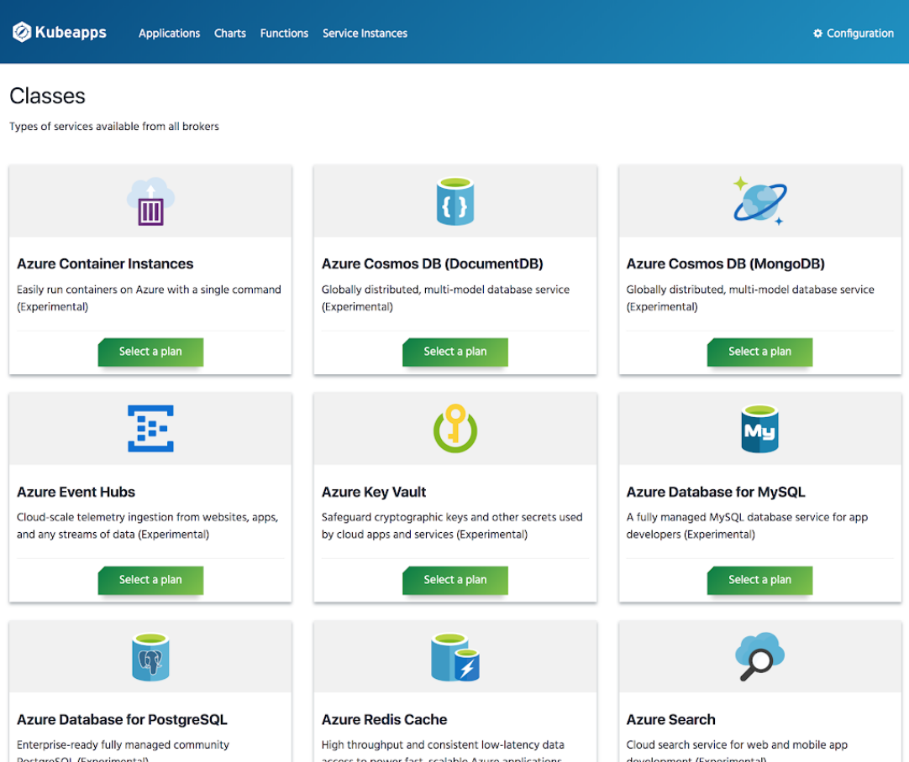
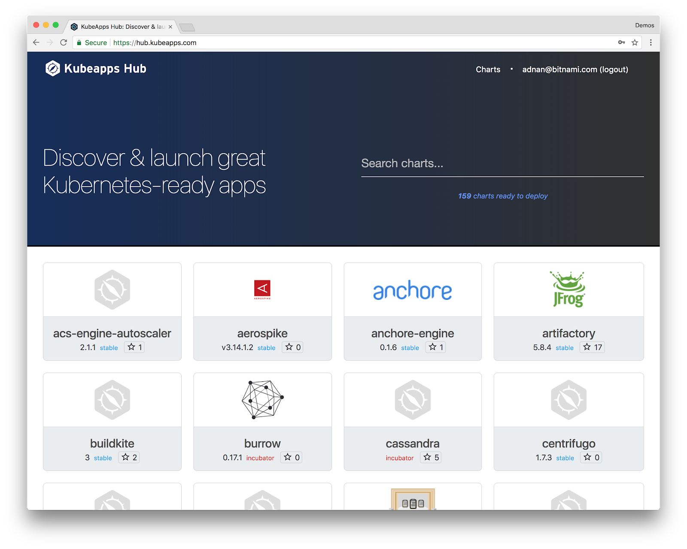
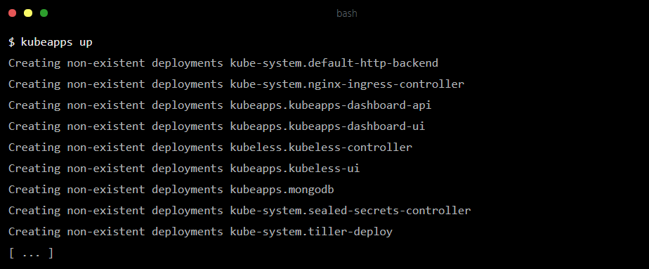
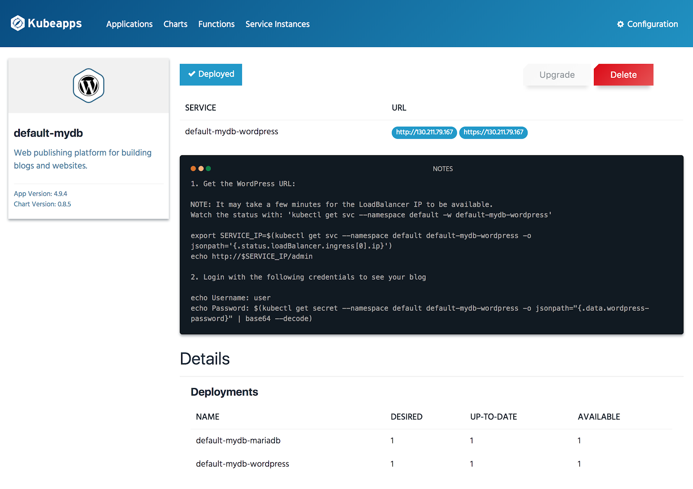

# I Can Haz Services?

### Kubeapps, OSB, Service Catalog, Oh my!

---

## In The Beginning...

There was Service Catalog and OSB

And there was Monocular

---

## And Then

Bitnami and Microsoft got together

---

## The Result!

---

---

---

## The Mighty Service Catalog
### An Illustraed Guide

---

## The Why

---

## Terminology

- OSB Broker
- Service Catalog
- Class
- Provision
- Bind

---

## Kubeapps

The Easiest Way to Deploy Applications to Your Kubernetes Cluster

---

##### Web-based Kubernetes App Community

Browse, Rate and Review the Kubernetes Community Charts
[hub.kubeapps.com](https://hub.kubeapps.com)

---

Kubeapps Combines our Kubenetes application packaging expertise

--- 

## No More Empty Clusters!

- Complete application delivery environment
- App-focused dashboard UI
- Simple browse and click deployment of apps
- Deploy Helm Charts and Kubeless Functions
- ... and now provision Service Instances and Bindings!

---

---

---

## Let's See Some **Wordpress!**

---

## A Fountain of Ideas

- Binding to apps is less sad
- `kubeapps up --cloud=$YOUR_CLOUD`
    - Installs service-catalog + `$YOUR_BROKER`
- Standard way of consuming secrets in upstream charts
    - PoC: [github.com/azure/helm-charts](https://github.com/azure/helm-charts)

---

## Thanks To

- Adnan Abdulhussein (@prydonius)
- Ara Pulido (@arapulido)
- Rita Zhang (@ritazzhang)
- Sertac Ozercan (@sozercan)
- Evan Louie (@evanlouie)
- Angel M Miguel (@_angelmm)
- Angus Lees
- Miguel Martinez (@migmartri)
- *Plenty More Folks*

[github.com/kubeapps/kubeapps/graphs/contributors](https://github.com/kubeapps/kubeapps/graphs/contributors)

